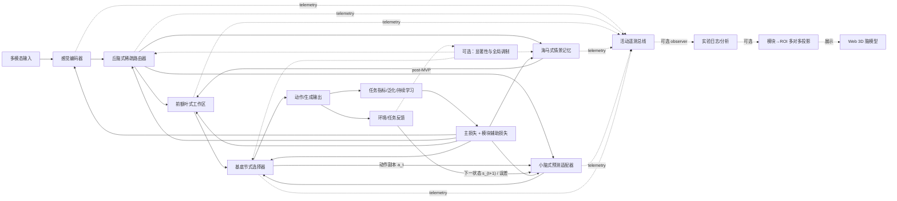

# 类脑神经网络设计与实现：可行性研究、计算架构与可视化附属方案

> 版本：0.4.0（GATE-1 后网络优先实施基线）
>
> 文献检索截止：2026-07-15
>
> 项目现状：仓库、`brain` 环境、P0 科学/计算规格和 P1 任务基线体系已完成，`GATE-0` 与 `GATE-1` 均通过；本文同时作为研究摘要、架构决策和实施蓝图。

## 0. 结论先行

本项目的核心目标是**设计、实现并验证类脑神经网络**。3D 脑模型仅是读取网络 telemetry 的可插拔可视化客户端，不参与模型决策，不作为网络 MVP 的完成条件，也不能反向主导网络结构。

目标在工程上**分层可行**：

- **高可行**：构建可训练、可替换、可消融的感觉、情景记忆、工作记忆、预测、路由和动作选择模块。
- **中高可行**：在多任务、持续学习和闭环决策中验证模块分工、通信、双速学习和预测误差机制是否优于容量匹配基线。
- **中低可行**：让网络结构、时间尺度、局部学习规则和长程连接同时达到较高生物合理性；这需要长期计算神经科学研究。
- **高可行但次要**：把网络活动、路由和学习信号投影到 3D 脑图谱作为调试与展示。
- **当前不可行**：按真实人脑的细胞、突触和认知机制复刻完整大脑，或由任意可视化推断“模型正在思考什么”。

因此，本项目应被准确命名为：

> **受神经科学启发、通过任务与因果实验验证的模块化认知网络。**

3D 展示是该网络的一个可选 observer，而不是项目本体。

不应宣称为“数字人脑”“意识仿真”或真实 fMRI/神经放电的复制。

推荐从一个可验证的最小闭环开始：

```text
视觉/文本输入
  → 丘脑式稀疏路由
  → 感知编码 + 海马式情景记忆 + 前额叶式工作区
  → 小脑式下一状态预测
  → 基底节式候选选择
  → 输出/动作与环境反馈
  → 多任务训练、消融、泛化与持续学习验证

旁路（可关闭）：模块 telemetry → 日志/分析 → 3D 脑图谱展示
```

在 2 名核心工程师、1 名兼职神经科学顾问、已有单卡 GPU 的假设下，**10–14 周可形成可信的类脑网络 MVP**；3D 展示层在 telemetry 稳定后约需 1–2 人周，可分段并行，完整因果视图要等待冻结消融结果，且不得阻塞网络 Gate。3–6 个月可形成多任务、持续学习研究原型。时间估计不包含大模型预训练、临床用途或真实脑成像数据采集。

---

## 1. 研究问题、边界与标注规范

### 1.1 核心研究问题

1. 哪些神经科学发现能转化为可训练、可证伪的计算原语？
2. 模块化网络怎样实现快速情景学习、慢速结构学习、工作记忆、预测、路由和动作选择？
3. 怎样通过容量匹配基线、多任务、消融、扰动、泛化和持续学习证明模块分工，而非仅赋予脑区名称？
4. 怎样协调不同模块的损失、时间尺度、状态和梯度，避免路由塌缩、灾难性遗忘与负迁移？
5. 大脑的宏观结构、功能分区和大尺度网络能为模块连接与训练提供哪些软先验？
6. 怎样将 telemetry 作为独立可观测性接口，并在不影响训练的前提下选择性投影到 3D 展示？

### 1.2 三层标注规范

本文所有脑—网络映射都应按以下三层理解：

- **Evidence（证据）**：论文或官方数据实际观察到的事实，必须保留物种、样本、尺度和测量方式。
- **Abstraction（工程抽象）**：从证据中提炼的计算原语，例如 memory、routing、prediction、selection、control。
- **Hypothesis（可检验假说）**：本项目选择的网络实现及其预测，必须可以通过实验被否证。

### 1.3 明确不可声称的内容

- 不能声称一个人工模块就是一个真实脑区。
- 不能从某个 3D 区域变亮反推出具体思想、情绪或意识状态。
- 不能把人工张量值、注意力权重、梯度或脉冲率等同于 BOLD 信号或真实神经元放电。
- 不能把小鼠局部微电路直接外推为整个人脑的通用接线规律。
- 不能把网络名称理解为该网络唯一承担的功能。
- 使用反向传播或 SNN 并不自动意味着具备生物真实性。

这不是措辞上的保守，而是核心技术约束。Poldrack 指出，从脑区活动反推认知过程的“反向推断”只有在该区域对该过程具有足够选择性时才有较强证据；通常并非如此。[Poldrack, 2006](https://pubmed.ncbi.nlm.nih.gov/16406760/)

---

## 2. 大脑构造与组织原则

### 2.1 多尺度组织

大脑至少应同时从四个尺度理解：

| 尺度 | 主要对象 | 对本项目的用途 | 不能推出什么 |
|---|---|---|---|
| 分子/细胞 | 基因表达、细胞类型、膜电活动 | 未来设计局部可塑性、兴奋/抑制、神经调质实验 | 不能直接决定宏观认知模块 |
| 局部微回路 | 层、核团、局部连接和群体动力学 | 设计 recurrent、预测误差、竞争与稳态机制 | 目前没有完整人脑微连接组 |
| 宏观脑区 | 皮层分区、皮层下核团、小脑 | 作为结构先验和 3D ROI 锚点 | 不能当作互斥的软件组件 |
| 大尺度网络 | 跨区功能连接、动态耦合、连续梯度 | 设计多对多模块映射、通信图和状态切换 | 网络边界不是永久固定的 |

HCP-MMP1.0 以多模态 MRI 在每个半球划分 180 个皮层区，说明宏观分区具有可重复的结构、功能、连接和拓扑边界；它仍是皮层区级图谱，不是突触接线图。[Glasser et al., 2016](https://www.nature.com/articles/nature18933)

Yeo 等基于 1,000 人静息态功能连接提出 7/17 网络分区，说明高阶功能更适合用跨区域网络描述；论文本身也提醒网络名称只是启发式标签，边界附近置信度较低。[Yeo et al., 2011](https://pmc.ncbi.nlm.nih.gov/articles/PMC3174820/)

### 2.2 主要结构与功能摘要

以下是为了工程设计而压缩的“主索引”，不是医学教科书的完整脑解剖：

| 结构/网络 | 证据支持的主要作用 | 关键限定 |
|---|---|---|
| 视网膜—外侧膝状体—视觉皮层 | 视觉预处理、视网膜拓扑、局部特征、物体/空间与动作相关加工 | 视觉通路有大量反馈，不是单向 CNN |
| 听觉通路与听觉皮层 | 时频、声学事件、语音与空间声源加工 | 存在复返和皮层下加工，不是单一频谱网络 |
| 体感与运动系统 | 身体状态、动作准备和群体动力学控制 | 单神经元语义弱，群体轨迹更重要 |
| 海马—内嗅系统 | 情景快速绑定、模式分离/补全、空间与关系表征、回放 | 长期知识并非只存海马；记忆依赖广泛皮层 |
| 前额叶—顶叶控制网络 | 目标、规则、工作记忆、任务切换、混合选择性 | 工作记忆可由持续活动或“静默”状态承载 |
| 基底节—皮层—丘脑环路 | 候选动作/策略竞争、动作强度、习惯和强化学习 | 直接/间接通路不能被简化成单一开/关按钮 |
| 丘脑及丘脑—皮层环路 | 感觉中继、增益、注意、皮层间有效连接和网络协调 | 丘脑不是透明总线；不同核团差异很大 |
| 小脑 | 时序、感觉后果预测、误差驱动适应和运动/认知校准 | “小脑只做误差校正”仍是过度简化 |
| 杏仁核及边缘回路 | 生物相关性、效价、显著性、价值线索和威胁学习 | 不是单一“恐惧中心” |
| 显著性网络 | 行为相关事件、冲突/内感受整合和网络切换候选 | 不等于杏仁核，也不是已证明的唯一总开关 |
| 背侧/腹侧注意网络 | 目标导向选择与意外事件重定向 | 网络边界和功能随任务而变 |
| 默认模式网络（DMN） | 内部导向认知、情景/未来模拟、自我相关和语义整合 | 不等于“休眠”，也不能直接等同生成模型 |
| 脑干/下丘脑/神经调质系统 | 唤醒、稳态、自主调节和广泛增益/学习调制 | 对无身体的纯软件系统只能做很粗的抽象 |
| 胼胝体和白质束 | 跨半球及长程通信 | 更适合作为边/带宽约束，而不是独立计算模块 |

丘脑参与注意和分布式认知控制的证据支持把它抽象为动态路由/增益系统，而非简单中继。[Halassa & Kastner, 2017](https://www.nature.com/articles/s41593-017-0020-1) 海马与新皮层的互补学习系统理论支持“快速情景写入 + 缓慢结构学习 + replay”的双速学习架构。[Kumaran, Hassabis & McClelland, 2016](https://pubmed.ncbi.nlm.nih.gov/27315762/) 小脑内部模型假说则启发短时程预测与误差校正模块，但仍应作为可检验抽象。[Wolpert, Miall & Kawato, 1998](https://doi.org/10.1016/S1364-6613(98)01221-2)

### 2.3 为什么应采用“多对多”映射

人工模块与脑 ROI 之间应是稀疏权重矩阵，而不是字典：

\[
M \in [0,1]^{R \times K}
\]

- \(R\)：3D 图谱中的脑区/网络数量；
- \(K\)：工程计算模块数量；
- \(M_{r,k}\)：模块 \(k\) 对 ROI \(r\) 的展示权重；
- 每个模块可投影到多个区；同一区也可叠加多个模块。

实现中把 `mapping_distribution[:, k]`（和为 1，只描述空间分布）与 `analogy_strength[k]`（0–1，只描述该工程类比的整体可信/显示增益）分开保存。前者不能冒充科学置信度，后者也不能通过重新分区 atlas 自动提升。

这使系统可以同时表达：

- 解剖区与功能网络的重叠；
- 同一模块对多个真实脑区的粗粒度类比；
- 后续按实验结果调整映射，而不改神经网络本体；
- 不同 atlas、个体模板和连续梯度视图的切换。

---

## 3. 脑功能区/回路到神经网络的工程映射

### 3.1 映射原则

1. 优先映射**计算目标**，不复制外形或名称。
2. 每个模块必须有清晰输入、输出、状态、训练信号和可观测量。
3. 模块必须能单独预训练、冻结、替换和消融。
4. `evidence_strength` 与 `analogy_distance` 必须分开：前者描述神经科学证据质量，后者用 A/B/C 表示工程实现距离计算抽象由近到远；A 不是“证据最高”。
5. 首版只实现能构成闭环并能被实验验证的模块。

### 3.2 建议映射表

| 脑系统启发 | 工程计算模块 | 推荐模型族 | 输入 → 输出 | 训练信号 | 3D/遥测指标 | 证据 / 类比距离 |
|---|---|---|---|---|---|---|
| 早期视觉皮层 | `visual_stem` | CNN/ViT patch stem；后期可试 recurrent/SNN | 图像/视频 → 局部视觉 token | 掩码重建、对比学习、分类/检测 | 特征 RMS、稀疏度、局部预测误差 | 高 / B |
| 腹侧视觉流 | `visual_what` | 对象中心编码器、ViT/slot attention | 视觉 token → 对象与语义表示 | 对象识别、分割、跨模态对齐 | 对象置信度、token surprise | 高 / B |
| 背侧视觉流 | `visual_where_action` | 视频 Transformer、光流/深度、时空状态模型 | 视频/动作上下文 → 运动、深度、动作相关空间 | 光流、深度、下一帧、视觉动作预测 | 运动能量、空间注意、状态变化 | 高 / B |
| 听觉系统 | `auditory_encoder` | learnable filterbank + Conformer/audio Transformer | 波形 → 声学事件、音素、声源表示 | 掩码音频、CTC、分离/定位 | 频带能量、事件概率、预测误差 | 高 / B |
| 语言腹侧流 | `language_semantic` | 语言 Transformer + 知识/记忆检索 | token/语音 → 语义与文本输出 | 下一 token、检索、语义对齐 | token surprise、检索量、专家路由 | 高 / C |
| 语言背侧流 | `language_sensorimotor` | 音素—发音/序列映射、语音解码器 | 声学/文本 → 音素或发音计划 | ASR、TTS 对齐、序列损失 | 对齐置信度、序列状态变化 | 中高 / C |
| 海马—内嗅系统 | `episodic_memory` | key-value memory、现代 Hopfield、向量检索、replay buffer | 事件/上下文 → 检索情景、相似轨迹 | 对比检索、时间顺序、重建、模式分离 | 写入率、top-k 相似度、检索熵、replay | 高 / B |
| 前额叶—额顶网络 | `working_memory_controller` | gated RNN/SSM + 小型 scratchpad + rule token | 目标/规则/感知/记忆 → 工作状态、子目标、控制门 | 延迟匹配、规则切换、元学习、过程监督 | 槽占用、状态保持、冲突、门值 | 高 / B |
| 丘脑 | `sparse_router` | top-k MoE router、cross-attention hub、动态通信图 | 模块摘要/目标/显著性 → 路由和增益 | 任务损失、负载均衡、通信成本 | routing mass、熵、负载、丢弃率 | 中高 / B |
| 基底节 | `action_selector` | actor–critic、option policy、Go/NoGo logits | 状态/候选/价值 → 选择、抑制、强度 | TD error、优势、行为克隆、安全约束 | 策略熵、Go−NoGo、TD error | 高 / B |
| 小脑 | `predictive_adapter` | 多时标 dynamics model、残差预测器、ensemble | 状态 + 动作副本 → 下一状态/感觉预测与校正 | 下一状态、轨迹误差、系统辨识 | prediction error、校正量、不确定性 | 中 / A |
| 杏仁核类回路 | `value_salience` | anomaly detector、风险/效价头、uncertainty ensemble | 多模态状态 + 目标 → 显著性、风险、效价 | 异常、危险/奖励、校准、偏好 | salience、novelty、风险、方差 | 中高 / B |
| 显著性网络 | `mode_scheduler` | 高层状态机/策略路由器 | 冲突、风险、资源、外部事件 → 模式权重/中断 | 切换收益、响应时延、误报漏报 | 切换概率、驻留时间、触发来源 | 中 / B |
| 背/腹侧注意网络 | `attention_allocator` | goal-conditioned cross-attention + interrupt attention | 目标/感觉/显著性 → attention mask/重定向 | 定位、稀疏注意、主动感知 RL | attention mass/熵、重定向频率 | 高 / B |
| 默认模式网络 | `offline_world_simulator` | 生成式世界模型、反事实 rollout、记忆重组 | 记忆/目标/内部状态 → 想象轨迹、摘要、候选计划 | 世界模型、重建、计划价值、压缩 | 内部生成率、rollout 深度、记忆调用 | 中 / C |
| 运动皮层/脊髓回路 | `motor_decoder` | policy decoder、trajectory model、低级控制器 | 选中动作/状态 → 连续控制或离散输出 | 模仿学习、轨迹、控制代价 | 动作强度、轨迹状态、输出置信度 | 高 / B |
| 神经调质/稳态 | `global_modulator` | 学习率/增益/探索/能量预算控制器 | reward prediction error、novelty、负载 → 全局/分区调制 | 稳定性、能量预算、元学习 | 调制值、目标活动偏差、能耗代理 | 中 / C |

视觉深层网络可预测部分感觉皮层群体反应，说明以任务驱动网络作为“可检验模型”是合理的；这不意味着 DNN 已复刻视觉皮层。[Yamins & DiCarlo, 2016](https://www.nature.com/articles/nn.4244) 多任务 RNN 能涌现功能专门化簇，也说明不应在初始化时把全部分工硬编码死。[Yang et al., 2019](https://www.nature.com/articles/s41593-018-0310-2)

### 3.3 首版保留、延期和排除

**MVP 必须实现：**

- 一个输入编码器（先视觉或文本，第二个模态随后加入）；
- `episodic_memory`；
- `working_memory_controller`；
- `sparse_router`；
- `predictive_adapter`；
- `action_selector`；
- 统一 telemetry 日志、任务基线、消融与泛化评估。

**`GATE-NN-MVP` 通过后加入：**

- 音频、双视觉流、语言双流；
- `value_salience` 与 `mode_scheduler`；
- offline replay 和世界模型；
- 多时间尺度、稳态调节和局部可塑性实验。

**可并行但非网络 Gate：**

- atlas 与模块—ROI 多对多映射；
- 3D viewer、时间轴和展示层性能优化。

**暂不进入主线：**

- 全脑细胞级仿真；
- 一开始就使用 360 个独立神经网络；
- 全系统 SNN 化；
- 意识、人格、情绪“读心”展示；
- 没有任务基准与消融证据的纯 3D 演示。

---

## 4. 推荐系统架构

### 4.1 总体结构



### 4.2 统一消息接口

模块不能直接依赖其他模块的内部张量结构。建议统一逻辑契约：

```python
BrainPacket:
    representation: Tensor        # [batch, time, feature]
    modality: str                 # vision/audio/text/state/latent
    timestamp: int | float
    valid_mask: Tensor | None
    spatial_reference: Tensor | None
    goal_context: Tensor | None
    salience: Tensor | None
    uncertainty: Tensor | None
    source_module: str
    memory_refs: list[str]

ModuleOutput:
    packet: BrainPacket
    prediction: Tensor | None
    action_proposals: Tensor | None
    auxiliary_losses: dict[str, Tensor]
    memory_events: list[MemoryEvent]
    telemetry: ModuleTelemetry
```

每个模块近似实现：

```python
forward(packet, recurrent_state, global_context)
    -> output, new_state, telemetry
```

这样 CNN、Transformer、状态空间模型、RNN、外部记忆甚至 SNN 可以被独立替换。

预测闭环必须显式记录转移 `(s_t, a_t, s_(t+1))`：预测器在动作执行前用 `s_t` 和选择器发来的 efference copy `a_t` 生成预测；环境返回 `s_(t+1)` 后才计算误差并更新。不能把预测时输入和反馈后的误差事件合为一个无时序张量。

### 4.3 训练顺序

不建议从随机初始化开始一次性联合训练全部模块：

1. 单独预训练感觉编码器和下一状态预测器。
2. 冻结主编码器，训练情景写入/检索与模式分离。
3. 加入工作区和动作选择，训练闭环任务。
4. 加入稀疏路由，使用负载均衡和通信成本约束。
5. 加入显著性/模式切换、replay 和世界模型。
6. 以较低学习率联合微调，同时保留各模块辅助损失。

---

## 5. 网络可观测性接口与可选 3D 展示语义

本节首先定义用于训练诊断、模块分析和实验复现的 telemetry。3D 只是这些数据的一个消费者；即使 viewer 完全不存在，telemetry 仍须可写入日志、用于统计和支持离线消融分析。

### 5.1 激活不是单一数值

不同网络的激活尺度不可直接比较，特别是 LayerNorm、不同宽度、不同激活函数和稀疏路由会产生系统性偏差。每个模块应至少记录：

| 指标 | 含义 | 训练 | 推理 | 是否用于亮度 |
|---|---|---:|---:|---:|
| `compute_gate` | 本次是否真正参与计算 | 是 | 是 | 必须 |
| `activity_raw` | hidden 的 RMS/平均绝对值或 SNN 脉冲率 | 是 | 是 | 仅归一化后 |
| `activity_z` | 相对模块自身历史基线的 robust z-score/分位数 | 是 | 是 | 核心 |
| `routing_mass` | 路由器分配的概率或信息流量 | 是 | 是 | 核心 |
| `state_change` | \(\|h_t-h_{t-1}\|\) | 是 | 是 | 辅助 |
| `surprise` | 预测误差或负对数似然 | 是 | 是 | 用独立色彩 |
| `confidence` | 模块输出置信度/校准概率 | 是 | 是 | 辅助 |
| `grad_rms` | 反向梯度强度 | 是 | 否 | 训练光晕 |
| `update_rms` | 参数实际更新量 | 是 | 否 | 可塑性通道 |
| `event_tags` | retrieve/write/select/interrupt/replay | 是 | 是 | 纹理/图标 |

生产主线应让 `BrainRegion`/模块**显式产出已在 GPU 上归约的小型 telemetry**；PyTorch forward/backward hooks 只作为调试或适配普通 `nn.Module` 的补充，因为 hooks 无法可靠覆盖函数式算子、编译融合和全部动态控制流。启用 `torch.compile` 时应在编译前安装固定 hooks，并单独测量 eager/compile 一致性、隐式 GPU 同步、开销和图中断风险。[PyTorch `nn.Module` hooks](https://docs.pytorch.org/docs/stable/generated/torch.nn.Module.html) [PyTorch compile 与 hooks](https://docs.pytorch.org/docs/stable/user_guide/torch_compiler/torch.compiler_nn_module.html)

### 5.2 亮度计算

模块内部先用滑动中位数和 MAD（或分位数）做稳健归一化，避免不同模块量纲冲突。ROI 亮度建议定义为：

\[
I_r(t)=\operatorname{EMA}_{\tau}\left[
\sum_k M_{r,k}\;c_k(t)\;\sigma(z_k(t))
\right]
\]

其中：

- \(M_{r,k}\)：模块到 ROI 的映射权重；
- \(c_k\)：`compute_gate`；
- \(z_k\)：模块自身基线标准化后的活动；
- \(\tau\)：显示平滑时间常数，初值建议 200–500 ms；
- `EMA` 用于减少闪烁，不能改变原始日志。

建议把信息拆为四种视觉通道，而不是都挤进亮度：

- 蓝—白：普通前向信息处理；
- 黄：注意/路由增益；
- 红：surprise、风险或冲突；
- 绿：记忆写入、replay、梯度或参数更新；
- 区域连线粒子/线宽：模块间通信流量；
- 时间轴：保留原始事件，可回放任意 step/token/frame。

`routing_mass` 只驱动黄色路由叠加层，不再乘入普通活动亮度；没有经过路由器的固定模块仍可正常显示。归一化必须按 `train/generate/replay` phase 分开保存并版本化；冷启动使用预先校准分位数，`MAD=0` 时回退到固定 epsilon/分位数范围，异常值先裁剪再平滑。回放必须引用原始事件所用的 baseline/reducer 版本，避免同一日志因在线基线漂移呈现不同颜色。

必须在 UI 常驻显示：**“模型活动遥测，不是 BOLD 或真实神经活动。”**

### 5.3 活动、重要性和因果贡献必须分开

- 高活动不等于对输出重要。
- 注意力权重不天然等于解释。
- 梯度是局部敏感度，不等于真实因果贡献。
- 最可信的离线验证是模块/连接消融、输入扰动和 counterfactual intervention。

UI 可提供三种模式：

1. `Activity`：实时活动与路由；
2. `Learning`：梯度、更新和 replay；
3. `Model Causal Effect`：人工模型内部离线消融导致的性能下降，不与实时活动混淆，也不声称证明真实脑区因果性。

---

## 6. 可选 3D 展示层与脑图谱数据

本节不属于类脑网络关键路径。只有模型接口、任务基线和 telemetry v1 稳定后才实施；展示层失败不得阻止网络训练、实验或 `GATE-NN-MVP`。

### 6.1 图谱路线

VIZ 首版推荐采用“**Schaefer-100（Yeo 7-network 标签）+ 同一 MNI152 空间内的少量皮层下 ROI + 可替换映射层**”。Schaefer-100 的粒度足够展示分布式网络，又不会让展示映射失控；海马、杏仁核、丘脑、尾状核、壳核、苍白球、伏隔核和小脑可由经过许可证审计的皮层下图谱补充。后续增加 Brainnetome 或 HCP-MMP1.0 作为精细视图。所有拼接资源都必须统一参考空间、affine、方向和分辨率。

VIZ 默认选择**体素标签 → 每 ROI 体积 mesh**，而不是把体素分区未经验证地投影到 fsaverage/fsLR 表面；这样皮层与深部结构共用 MNI152 坐标。外层另放半透明脑表面作为解剖外壳。启动 VIZ 时必须先冻结皮层下/小脑 atlas 的确切名称、版本、阈值、重叠优先级、许可证和最终 ROI 数 `N_roi`；若改用 surface labels，视为独立资产路线，必须显式选择表面模板与注册方法。

可选资源：

| 资源 | 优点 | 限制/用途 |
|---|---|---|
| [Schaefer 2018 / Nilearn fetcher](https://nilearn.github.io/stable/modules/generated/nilearn.datasets.fetch_atlas_schaefer_2018.html) | 100–1,000 ROI，带 Yeo 7/17 网络标签，可程序化获得 MNI152 NIfTI/LUT | VIZ 皮层首选；本身不含所需皮层下结构 |
| [Brainnetome Atlas](https://pmc.ncbi.nlm.nih.gov/articles/PMC4961028/) | 246 区，兼顾皮层和皮层下，提供连接与功能描述 | 第二套完整视图候选；使用前固定版本并复核再分发许可 |
| [HCP-MMP1.0](https://www.nature.com/articles/nature18933) | 每半球 180 皮层区，多模态边界 | 只覆盖皮层；用于精细皮层视图 |
| [EBRAINS Human Brain Atlas](https://ebrains.eu/data-tools-services/brain-atlases/human-brain) | Julich-Brain、BigBrain、纤维束和跨空间数据 | 科学分析强，Web 资产转换较复杂 |
| [Allen Human Brain Atlas](https://human.brain-map.org/static/about?rw=t) | 解剖与基因表达参考 | 供体较少，不能作为实时功能真值 |
| [TemplateFlow](https://www.templateflow.org/python-client/master/index.html) | FAIR、程序化版本/元数据/引用访问，含 MNI、fsLR、fsaverage | 每个资源许可证不同，必须逐项读取 metadata |

图谱不是模型真值。不同 atlas 会给出不同边界，功能连接还具有个体差异；系统必须把 `atlas_id`、版本、空间和许可证写入资产 manifest。

离线资产构建顺序应固定为：

```text
下载并校验 checksum
→ 记录版本/许可/引用
→ 统一 NIfTI 方向、affine、单位与 MNI152 分辨率
→ 用最近邻插值重采样离散标签
→ 记录重叠优先级与概率 atlas 阈值
→ 每 ROI 提取等值面并做轻度平滑/简化
→ 检查左右翻转、质心和体积误差
→ 合并为 GLB + atlas_manifest.json + vertex_to_roi
```

离散标签严禁用线性插值；随机抽查至少 20 个 ROI，其质心与官方切片/viewer 的偏差应不超过 1 个源体素。主要 ROI 网格体积相对源 mask 误差目标 < 5%，小型深部 ROI < 10%。

### 6.2 渲染路线

推荐 Web 架构而不是把渲染耦合进训练进程：

```text
PyTorch train/inference
  → non-blocking telemetry queue
  → 20–30 Hz reducer / sampler
  → MessagePack 或紧凑 JSON WebSocket
  → React + Three.js
  → GPU vertex color / shader update
```

Three.js `BufferGeometry` 支持位置、法线、颜色和自定义 buffer attribute，适合把 ROI 或顶点强度常驻 GPU 并只更新颜色/标量；更新颜色 buffer 时设置 `needsUpdate`。[Three.js BufferGeometry](https://threejs.org/docs/pages/BufferGeometry.html) [BufferAttribute](https://threejs.org/docs/pages/BufferAttribute.html)

实现要点：

- 网格预处理阶段生成 `vertex_to_roi`，运行时不做空间查询；
- 训练进程只发送 ROI/模块标量，不发送大张量；
- 遥测队列采用有界 ring buffer，满时丢旧帧而不是阻塞训练；
- 20–30 Hz 足够表达 token/step 活动，训练内部仍保留原始 step 日志；
- 支持表面、透明皮层下结构、切面和左右半球分离；
- 鼠标选区显示来源模块、原始指标、映射权重和证据等级；
- 连接边只显示 top-k 流量，避免视觉拥塞。

### 6.3 遥测事件契约

```json
{
  "schema_version": "1.0",
  "run_id": "...",
  "episode_id": "...",
  "step": 1024,
  "token_or_frame": 17,
  "event_id": "...",
  "parent_event_id": "...",
  "phase": "train",
  "monotonic_time_ns": 0,
  "module_tick": 42,
  "module_id": "episodic_memory",
  "atlas_version": "...",
  "mapping_version": "...",
  "baseline_version": "...",
  "reducer_version": "...",
  "compute_gate": 1.0,
  "activity_z": 1.42,
  "routing_mass": 0.31,
  "state_change": 0.28,
  "surprise": 0.76,
  "grad_rms": 0.08,
  "events": ["retrieve", "write"],
  "dropped_since_last": 0,
  "edges": [{"target": "working_memory_controller", "flow": 0.54}]
}
```

事件必须包含 schema、run/episode/step/token、父子事件、单调时间、模块本地时钟、atlas/mapping/baseline/reducer 版本、阶段、来源和丢帧计数，以支持 token 级追踪、确定性重放、对比实验和兼容升级。

---

## 7. 网络优先的分阶段实施路线

### 阶段 P0：科学假说与计算规格（1–2 周）

**目标**：把神经科学证据转化为可训练、可消融、可否证的模块规格。

工作：

- 建立 `Evidence / Abstraction / Hypothesis` registry；
- 为每个 MVP 模块定义输入、输出、状态、时间尺度、损失、优化边界和消融；
- 冻结 `BrainPacket`、`ModuleOutput`、module registry、状态生命周期和连接图；
- 冻结三个任务：Associative Recall、Delayed Rule Switch、内置 SmallGraph-v1；
- 冻结参数匹配主基线、训练计算与推理成本匹配敏感性基线、数据划分、种子和统计协议；
- telemetry 只定义与模型语义相关的事件，不在 P0 绑定 atlas 或 3D。

验收：

- 100% MVP 模块主张都有对应证据、工程假说和否证条件；
- 每个模块都有可测功能指标和独立单元测试；至少三个关键模块有预注册任务级消融，编码器和选择器有容量匹配替换/扰动对照；
- 三个任务均有随机/单体基线和确定性 smoke 配置；
- 模型在无 viewer、无 atlas、无 Web 服务环境中可完整训练和评估。

### 阶段 P1：任务基线与训练骨架（2 周）

**目标**：先建立可信的行为基线、训练循环和复现体系，防止模块化架构只与弱基线比较。

工作：

- 实现任务数据、环境适配、run manifest、checkpoint 和 seed 管理；
- 实现三类公平单体对照：参数匹配为主比较，训练 token/环境步数与 wall-clock 匹配、推理 FLOPs/延迟匹配为敏感性比较；另保留随机策略和简单记忆基线；
- 建立训练/验证/测试、早停、指标、bootstrap CI 和 FLOPs/参数统计；
- 建立梯度、NaN、状态泄漏、序列 mask 和确定性测试；
- 跑通三个任务的 1-seed smoke 与至少一个正式基线。

验收：

- fresh 环境可复现 smoke run；
- 同一 seed 的关键指标在允许数值误差内一致；
- 所有后续模型可复用同一任务、预算和评估接口；
- 参数匹配主基线与训练计算、推理成本两类敏感性基线均可运行；无法同时匹配的维度必须显式披露；
- 基线参数量、训练 token/环境步数、wall-clock、推理 FLOPs 和延迟全部记录。

### 阶段 P2：最小模块化类脑网络（3–4 周）

**目标**：实现感觉编码、情景记忆、工作记忆、预测适配、动作选择和稀疏路由的计算闭环。

工作：

- 先分别实现与测试各模块，再按依赖顺序集成；
- 显式记录 `(s_t, a_t, s_(t+1))` 动作副本与预测误差；
- 为情景记忆实现快速写入、模式分离/检索和 replay 接口，但 MVP 不强制长期 replay；
- 为工作区实现规则/目标保持、状态更新门和容量限制；
- 为路由器实现 top-k、负载均衡、通信成本和防塌缩监控；
- 为模块设置主任务损失与辅助损失，报告梯度冲突和权重敏感性；
- telemetry 写入结构化日志；3D 消费者仍为可选。

验收：

- ≥5 个模块通过版本化接口参与同一 forward/backward 闭环；
- 三个任务均无 NaN、死锁、状态串扰或不可控图增长；
- 路由器只在任务特定 `eligible_experts` 内统计稀疏率；必经模块不进入分母；当 eligible set ≥4 时平均激活率目标 ≤60%，并按预期任务分布检查负载偏差而非统一惩罚高频必经模块；
- telemetry on/off 等价性分三层验证：固定 checkpoint/input 的推理输出 `allclose`，单训练步的 loss/gradient/update `allclose`，同 seed 完整训练的主指标处于预注册容差内；性能开销另行报告；
- 网络能在不安装前端依赖的环境中通过全部模型测试。

### 阶段 P3：功能分工、泛化与因果验证（5–6 周）

**目标**：证明“类脑模块化”产生可重复的计算收益，而不是脑区命名或参数增加带来的错觉。

工作：

- 完整模型和容量/预算匹配基线各运行 ≥3 seeds；
- 预注册无记忆、无工作区、无预测器、固定路由、随机路由和单体模型对照；
- 测试训练分布外延迟长度、记忆干扰、环境转移和规则组合泛化；
- 加入固定预算的 3 任务顺序学习小实验，记录平均遗忘和前向/负迁移；P4 再扩展完整 replay 与 7 任务研究；
- 用 linear probe、CKA/RSA、路由熵、状态动力学和跨 seed 对齐分析分工；
- 用冻结随机/浅层编码器替换对照，以及直接 policy head 替换动作选择器的冲突扰动对照，覆盖其功能指标；
- 比较联合训练、分阶段训练、冻结/解冻与辅助损失权重；
- 报告失败结果、置信区间、效应量、计算成本和未验证假说。

验收：

- 情景记忆相对无记忆基线提升 ≥15 个百分点且 95% CI 不跨 0；
- 工作区消融使延迟/规则任务下降 ≥10 个百分点且 95% CI 不跨 0；
- 预测器消融使外部 probe 或闭环样本效率至少一项恶化 ≥10%；
- 模块化模型在以下五项中至少两项达到预注册门槛：任务分数相对提高 ≥5%；OOD 归一化分数提高 ≥5%；达到目标分数的样本数减少 ≥15%；3 任务平均遗忘绝对降低 ≥5 个百分点；活跃模块 FLOPs 减少 ≥20% 且任务分数不劣于基线超过 2%；所有收益均要求 bootstrap 95% CI 支持预期方向；
- 至少 3 个模块通过预注册消融证明模型内部因果贡献；
- 若达不到阈值，`GATE-NN-MVP` 失败，不得用 3D 演示替代。

### 阶段 P4：持续学习、生成与世界模型（4–8 周）

**目标**：在网络 MVP 的 3 任务顺序学习筛查后，扩展完整双速学习、离线巩固和内部模拟。

工作：

- 加入生成解码器、world-model rollout 与反事实候选；
- 分离在线任务学习、情景快速写入和离线 consolidation；
- 实现 replay 来源、优先级、过期、删除和污染测试；
- 评估 1/3/7 个后续任务后的平均遗忘、前向迁移和负迁移；
- 比较 replay、正则、参数隔离和无持续学习机制基线。

验收：

- 每个生成 token/frame 可追溯到模块状态与记忆事件；
- 3 seeds 下，7 个后续任务后的平均遗忘相对无 replay 降低 ≥20%，否则不得声称持续学习改善；
- 记忆删除、过期和污染测试通过；
- 世界模型的收益必须同时报告额外参数、FLOPs 和 rollout 成本。

### 可选 VIZ：3D 展示层（telemetry v1 稳定后，约 1–2 人周，分段交付）

**目标**：把已经验证的模块 telemetry 映射到脑图谱，用于调试、回放和演示。

工作：

- 选择 atlas、审计许可证、生成 ROI mesh 和多对多映射；
- 构建 replay/WebSocket 服务与 Three.js viewer；
- 实现 Activity、Learning、Model Causal Effect 三视图；
- 用冻结日志开发，禁止 viewer 反向依赖模型内部张量；
- 测量 FPS、延迟、内存与训练开销。

验收：

- 关闭/卸载 viewer 不影响任何模型测试或实验；
- 3D 数据全部来自版本化 telemetry 或冻结消融报告；
- viewer 断线不阻塞训练；
- 30 Hz、约 110–130 ROI 时 ≥55 FPS，事件到画面 p95 <150 ms；
- UI 常驻“模型活动遥测，不是 BOLD 或真实神经活动”。

### 阶段 P5：生物合理性研究支线（6–12 周/项）

只在 `GATE-NN-MVP` 通过后独立开展：

- recurrent predictive coding 与普通前馈编码器比较；
- ANN/SNN 混合感觉前端；
- STDP/三因子局部学习与反向传播代理比较；
- homeostatic activity target 和能量/通信预算；
- 连接组软先验与图神经网络；
- 用公开 fMRI/电生理数据做 representational similarity。

每项必须同时报告任务性能、生物数据拟合、泛化、计算成本和失败结果。

---

## 8. 验证与实验设计

### 8.1 验证层级

| 层级 | 要证明什么 | 方法 |
|---|---|---|
| 单元 | 模块状态、形状、梯度、mask、损失和时间语义正确 | 固定张量、属性测试、数值边界、梯度检查 |
| 集成 | 模块路由、状态生命周期、动作副本和多损失训练正确 | 小模型端到端、序列边界、冻结/解冻、checkpoint 恢复 |
| 任务 | 模块化网络确实改善预期能力 | 容量匹配基线、消融、扰动、多种子、预定义统计 |
| 泛化 | 收益不是训练集记忆或 benchmark 特化 | 延迟外推、组合规则、环境转移、记忆干扰 |
| 持续学习 | 快慢学习与 replay 是否降低遗忘 | 任务序列、平均遗忘、迁移和负迁移 |
| 表征 | 分工是否涌现、稳定、可解释 | linear probe、RSA/CKA、路由熵、跨种子对齐 |
| 因果 | 模块/连接对人工模型行为有贡献 | module/edge ablation、activation patching、counterfactual |
| 训练性能 | 模块化收益是否值得额外成本 | 参数、FLOPs、显存、吞吐、wall-clock、样本效率 |
| 可观测性 | telemetry 不改变训练语义 | on/off 等价性、开销、schema 与日志回放 |
| 可选展示 | 3D 只忠实消费 telemetry | 随机映射对照、断连测试、视觉快照和免责声明 |

### 8.2 必须保留的对照组

- 相同参数量的单体 RNN/Transformer，作为主要价值比较；
- 相同训练 token/环境步数与 wall-clock 的单体基线，作为训练计算敏感性比较；
- 相同推理 FLOPs/延迟的单体基线，作为部署成本敏感性比较；
- 固定均匀路由；
- 随机/任务无关路由；
- 随机初始化但不训练的模块；
- 无记忆、无预测、无工作区的逐项消融；
- 去除辅助损失、分阶段训练与联合训练对照；
- 只有在实施 VIZ 时才加入随机模块—ROI 映射和活动匹配但输出打乱的展示对照。

网络价值由任务、泛化、持续学习和模型内部因果实验决定。3D 映射只能帮助观察和沟通，不能为网络有效性提供主要证据。

### 8.3 可证伪预测示例

| 假说 | 操作 | 预期 | 否证条件 |
|---|---|---|---|
| 情景记忆支持快速绑定 | 提供一次性事件，后续给部分线索并增加干扰项 | 检索准确率、模式分离和样本效率提升 | 无记忆容量匹配模型同样好，或只增加活动不改善行为 |
| 工作区支持规则保持 | 延长提示—响应间隔 | 工作状态驻留延长，消融后性能随延迟下降 | 消融无影响或只改变亮度 |
| 预测器支持状态估计与样本效率 | 插入违反动力学的转移并改变环境 dynamics | prediction error 区分正常/异常，外部 probe 或闭环学习改善 | 只有辅助损失下降但行为/泛化无改善 |
| 稀疏路由降低无关计算 | 切换任务和输入模态 | 专家使用随任务重组，FLOPs 下降且性能保持 | 所有专家始终同样活跃或路由塌缩 |
| 选择器处理候选冲突 | 制造两个价值接近的动作 | 策略熵/Go−NoGo 冲突上升，反应变慢 | 冲突指标与选择难度无关 |
| 快慢学习降低灾难性遗忘 | 顺序训练多个任务 | replay/巩固降低平均遗忘并保持旧任务 | 旧任务保持不优于容量匹配持续学习基线 |

---

## 9. 技术栈与建议目录

### 9.1 技术选择

- 网络主线：Conda `brain`、Python 3.12、PyTorch 2.12.1；配置用 YAML；所有模块将实现统一 state/packet/loss/telemetry 接口。
- 实验：结构化 run manifest + JSONL/TensorBoard；强制记录 seed、数据版本、参数量、FLOPs、预算、基线和消融。
- 任务：自建可控认知任务 + 内置 SmallGraph-v1；后续再扩展多模态和连续学习 benchmark。
- 测试：pytest、Hypothesis、Ruff、mypy、CPU/MPS smoke；后续补充梯度/状态/序列属性、checkpoint 复现和多种子统计。
- 可观测性：结构化 telemetry 与离线分析优先；FastAPI/WebSocket 仅用于外部消费者。
- 可选展示：TypeScript + React + Three.js、Nibabel/Nilearn/TemplateFlow；与模型 Python 依赖隔离。

Python/PyTorch 主线和开发门禁已经安装并生成 osx-arm64 锁与环境清单；本机 Apple M4 MPS forward/backward 已通过。Linux/CUDA 锁必须在真实对应主机生成。Node 与所有可选展示依赖仍未安装。项目当前为专有、未授权发布状态，第三方依赖许可证清单仍需在发布或外部分发前生成。

### 9.2 拟建目录

```text
neuromorphic/
├── pyproject.toml
├── configs/
│   ├── modules.yaml
│   ├── brain_mapping.yaml
│   └── experiments/
├── src/neuromorphic/
│   ├── core/contracts.py
│   ├── core/registry.py
│   ├── modules/
│   │   ├── encoders.py
│   │   ├── episodic_memory.py
│   │   ├── working_memory.py
│   │   ├── sparse_router.py
│   │   ├── predictive_adapter.py
│   │   └── action_selector.py
│   ├── training/
│   ├── tasks/
│   ├── evaluation/
│   ├── telemetry/
│   │   ├── hooks.py
│   │   ├── normalization.py
│   │   ├── events.py
│   │   └── publisher.py
│   └── analysis/
├── baselines/
├── reports/
├── visualization/                 # 可选；不被模型包依赖
│   ├── assets/
│   │   ├── atlas_manifest.yaml
│   │   ├── brain_mesh.glb
│   │   └── vertex_to_roi.bin
│   ├── server/
│   └── web/
├── scripts/
│   ├── run_experiment.py
│   ├── run_ablations.py
│   └── build_atlas_assets.py       # 可选展示
├── tests/
│   ├── unit/
│   ├── integration/
│   └── e2e/
└── docs/
    ├── evidence_registry.md
    └── experiment_protocols.md
```

上述均为**拟建路径**；当前仓库尚无源码。

---

## 10. 风险与缓解

| 风险 | 后果 | 缓解 |
|---|---|---|
| 模块只是人工命名，没有计算收益 | “类脑”成为标签工程 | 容量匹配单体基线、预注册消融、泛化和持续学习 Gate |
| 多模块损失与梯度冲突 | 某模块学不到或拖累主任务 | 分阶段训练、冻结/解冻、梯度余弦监控、损失权重敏感性 |
| 任务过于简单或可被捷径解决 | 模块作用无法辨别 | 干扰项、组合泛化、延迟外推、环境转移和 shortcut audit |
| 模块接口过早固定 | 后续 SNN/SSM/不同时间尺度难以接入 | packet/state/loss 语义稳定，实现类型可替换；契约测试 |
| 路由塌缩 | 少数专家垄断、其余失活 | 负载均衡、容量限制、熵/使用率阈值、curriculum |
| 灾难性遗忘与负迁移 | 多任务互相破坏 | 双速学习、replay、参数隔离/正则、持续学习基准 |
| 公平基线缺失 | 无法判断复杂度是否值得 | 同时匹配参数、训练预算、FLOPs；无法同时匹配时报告双对照 |
| 一脑区一功能的定位谬误 | 科学错误、误导用户 | 多对多映射、Evidence/Abstraction/Hypothesis、常驻声明 |
| 活动量纲不可比 | 某些模块永远更亮 | 模块内稳健基线、路由/compute gate、分通道展示 |
| 3D 动画漂亮但无效 | 无法证明模块作用 | 强制任务基准、消融、随机映射对照、Model Causal Effect 独立视图 |
| 记忆污染与隐私 | 错误/敏感内容被 replay | 写入门、来源、版本、过期、删除、敏感信息过滤 |
| telemetry 拖慢训练 | GPU 同步、吞吐下降 | 无界张量禁止上总线、CPU 异步聚合、有界队列、采样 |
| 图谱许可/再分发问题 | 无法发布资产 | manifest、逐资源许可证复核、只分发转换脚本或可再分发资产 |
| atlas/个体差异 | 假精确定位 | 支持 atlas 切换、软权重、个体偏移；不显示虚假毫米精度 |
| 多时间尺度被压成一帧 | 记忆/预测/动作关系失真 | event time、模块时钟、时间轴、延迟/相位可视化 |
| 展示层挤压网络研究 | 网络尚未验证却先优化画面 | VIZ 独立 Gate；不得成为 `GATE-NN-MVP` 依赖 |
| 生物合理性支线挤压主线 | 模型复杂但任务失败 | 网络 MVP 与研究支线分离，每项支线必须有基线和退出条件 |
| “类脑”命名过度宣传 | 伦理和可信度风险 | 使用“海马式”“丘脑式”等启发式命名，公开非等价性 |

---

## 11. 架构决策记录（ADR）

### Decision

采用**网络优先的功能启发模块化架构**：任务、训练、泛化、持续学习和因果验证构成唯一核心主线；telemetry 是可观测性接口；3D 脑图谱是可插拔展示适配器。SNN、局部可塑性、连接组约束和精细脑图谱均为后续研究支线。

### Drivers

1. 首版必须在行为、泛化、持续学习或稀疏计算上证明模块化价值。
2. 所有脑功能类比必须有可证伪假说、容量匹配基线和模型内部因果实验。
3. 网络必须能脱离 atlas、viewer 和 Web 服务独立训练、评估与复现。

### Alternatives considered

**A. 功能启发的模块化 ANN（选择）**

- 优点：训练工具成熟、容易建立基线和消融、可快速形成闭环、遥测简单。
- 缺点：学习规则和时间编码与生物大脑差异大。

**B. 从第一天开始全 SNN**

- 优点：事件驱动和时间动力学更接近神经元表述，可探索能效硬件。
- 缺点：训练、任务性能、工具链和大模型集成风险显著更高；SNN 也不等于完整生物真实性。
- 结论：保留为感觉前端或局部微回路实验，不做 MVP 主线。

**C. 由 3D 脑区/连接组反向决定 246/360 区网络**

- 优点：展示层与宏观解剖结构看起来更直接。
- 缺点：现有 MRI 连接组不是功能计算蓝图；从一开始创建数百模块会让训练和归因失控。
- 结论：拒绝作为主线；图谱仅作后期展示或经过实验验证的软连接先验。

**D. 单体 Transformer + 把层映射到脑区**

- 优点：最快得到生成能力。
- 缺点：脑区映射主要是事后故事，缺少可消融的计算分工。
- 结论：作为性能基线保留，不作为最终架构。

### Why chosen

方案 A 最能满足可训练、可证伪、可复现和渐进提高生物合理性的目标。只有先证明模块在任务、泛化或持续学习中有用，后续脑图谱投影才有值得展示的内容。

### Consequences

- `GATE-NN-MVP` 不依赖 3D、atlas 或前端资产。
- 3D 位置只是计算模块的软投影，不是模型内部物理位置。
- 首版生物真实性有限，但每一项类比必须能单独测试、替换和否证。
- 核心维护对象是 evidence registry、模块契约、实验协议、基线、消融和 run manifest；atlas manifest 属于可选展示资产。
- 任何对外演示都必须显示模型活动声明，并引用已经冻结的网络实验结果。

### Follow-ups

1. P0 冻结模块假说、接口、三个任务和公平基线。
2. P1 先完成单体基线、训练骨架和复现环境。
3. P2 实现模块化闭环；P3 用消融、泛化和持续学习决定是否通过 `GATE-NN-MVP`。
4. telemetry v1 稳定后，可并行启动 VIZ；VIZ 不得反向修改网络结构以追求更好看的点亮效果。
5. `GATE-NN-MVP` 通过后，再决定是否加入 SNN、世界模型、局部学习和连接组先验。

---

## 12. 里程碑完成定义

### 12.1 `GATE-NN-MVP`：初步类脑神经网络

项目只有同时满足以下条件，才可以称为“初步类脑神经网络”：

- [ ] 至少 5 个功能模块参与同一个可训练闭环任务；
- [ ] 模块间通过版本化接口、显式状态和可测路由通信；
- [ ] 每个模块有独立损失或可测功能指标；
- [ ] 三个任务和参数匹配主基线使用相同数据与评估接口，训练计算、推理成本匹配基线完成敏感性比较；
- [ ] 至少 3 个模块的预注册消融达到可重复的行为阈值；
- [ ] 报告训练分布外泛化、样本效率、参数、FLOPs、显存和 wall-clock；
- [ ] 路由没有塌缩，模块状态没有跨 episode 泄漏；
- [ ] telemetry 可完全关闭，关闭后模型输出与训练语义不变；
- [ ] 支持训练、推理、checkpoint 恢复、日志分析和 fresh 环境复现；
- [ ] 与单体、固定路由、随机路由、无记忆、无预测、无工作区完成对照；
- [ ] 文档报告失败结果、种子方差、限制和未验证假说。

`GATE-NN-MVP` **不要求** 3D viewer、atlas mesh 或脑区点亮。

### 12.2 `GATE-VIZ`：可选 3D 展示

只有在网络 telemetry v1 稳定后才评审：

- [ ] 3D 显示完全来自版本化 telemetry 或冻结消融报告；
- [ ] viewer 断线、关闭或未安装不影响模型训练和评估；
- [ ] Activity、Learning、Model Causal Effect 三类语义分离；
- [ ] atlas、映射、证据和许可证可追溯；
- [ ] 性能达到冻结 benchmark profile 的 FPS/延迟阈值；
- [ ] UI 明示模型活动不等于真实脑活动。

---

## 13. 核心文献与数据源

### 脑图谱与网络组织

1. Glasser et al. (2016), *A multi-modal parcellation of human cerebral cortex*. 每半球 180 个多模态皮层区。[Nature](https://www.nature.com/articles/nature18933)
2. Yeo et al. (2011), *The organization of the human cerebral cortex estimated by intrinsic functional connectivity*. 1,000 人、7/17 网络。[PMC](https://pmc.ncbi.nlm.nih.gov/articles/PMC3174820/)
3. Eickhoff, Yeo & Genon (2018), *Imaging-based parcellations of the human brain*. 分区尺度与方法局限综述。[Nature Reviews Neuroscience](https://www.nature.com/articles/s41583-018-0071-7)
4. Human Connectome Project，宏观结构/功能连接数据与 Connectome Workbench。[HCP 官方](https://www.humanconnectome.org/software/)
5. EBRAINS Human Brain Atlas，Julich-Brain、BigBrain、纤维束和跨空间资源。[EBRAINS 官方](https://ebrains.eu/data-tools-services/brain-atlases/human-brain)
6. Allen Human Brain Atlas，解剖与基因表达多模态参考。[Allen 官方](https://human.brain-map.org/static/about?rw=t)
7. Ciric et al. (2022), *TemplateFlow: FAIR-sharing of multi-scale, multi-species brain models*. [Nature Methods](https://doi.org/10.1038/s41592-022-01681-2)

### 功能系统与计算抽象

8. Hickok & Poeppel 双流语言框架的后续综合：语义腹侧流与感觉运动背侧流。[PMC](https://pmc.ncbi.nlm.nih.gov/articles/PMC3468690/)
9. Buckner, Andrews-Hanna & Schacter (2008), 默认网络的解剖、功能与多个子系统。[PubMed](https://pubmed.ncbi.nlm.nih.gov/18400922/)
10. Sridharan, Levitin & Menon (2008), 右额岛与执行/默认网络切换的 fMRI/因果建模证据。[PMC](https://pmc.ncbi.nlm.nih.gov/articles/PMC2527952/)
11. Halassa & Kastner (2017), 丘脑在分布式认知控制中的作用。[Nature Neuroscience](https://www.nature.com/articles/s41593-017-0020-1)
12. Park, Coddington & Dudman (2020), 基底节回路与动作规格/选择。[Annual Review of Neuroscience](https://www.annualreviews.org/content/journals/10.1146/annurev-neuro-070918-050452)
13. Pessoa & Adolphs (2010), 杏仁核参与对生物意义的网络协调，而非简单“低路恐惧中心”。[Nature Reviews Neuroscience](https://www.nature.com/articles/nrn2920)
14. Wolpert, Miall & Kawato (1998), 小脑内部模型假说。[DOI](https://doi.org/10.1016/S1364-6613(98)01221-2)
15. Kumaran, Hassabis & McClelland (2016), 更新后的互补学习系统理论。[PubMed](https://pubmed.ncbi.nlm.nih.gov/27315762/)
16. Bellmund et al. (2018), 人类空间及抽象认知图。[Nature Neuroscience](https://www.nature.com/articles/nn.4656)

### 神经编码、类脑模型与解释边界

17. Poldrack (2006), 神经影像反向推断的限制。[PubMed](https://pubmed.ncbi.nlm.nih.gov/16406760/)
18. Logothetis et al. (2001), BOLD 与局部场电位/神经活动关系。[Nature](https://www.nature.com/articles/35084005)
19. Kriegeskorte & Wei (2021), 神经调谐与群体表征几何。[Nature Reviews Neuroscience](https://www.nature.com/articles/s41583-021-00502-3)
20. Yamins & DiCarlo (2016), 用目标驱动深度网络作为感觉皮层的可检验模型。[Nature Neuroscience](https://www.nature.com/articles/nn.4244)
21. Yang et al. (2019), 多任务 RNN 中涌现的任务表示与功能簇。[Nature Neuroscience](https://www.nature.com/articles/s41593-018-0310-2)
22. Graves et al. (2016), 带动态外部记忆的神经计算系统。[PubMed](https://pubmed.ncbi.nlm.nih.gov/27732574/)
23. Georgopoulos et al. (1986), 运动皮层群体向量编码。[PubMed](https://pubmed.ncbi.nlm.nih.gov/3749885/)
24. Rigotti et al. (2013), 前额叶混合选择性与高维任务表征。[Nature](https://www.nature.com/articles/nature12160)
25. Rao & Ballard (1999), 视觉皮层预测编码模型。[Nature Neuroscience](https://www.nature.com/articles/nn0199_79)

### 公开数据尺度的现实边界

26. Shapson-Coe et al. (2024), 约 1 mm³ 人类皮层的纳米级连接组，仅代表极小局部样本。[PMC](https://pmc.ncbi.nlm.nih.gov/articles/PMC11718559/)
27. MICrONS Consortium (2025), 单只小鼠视觉皮层约 1 mm³ 的结构—功能配准连接组。[Nature](https://www.nature.com/articles/s41586-025-08790-w)
28. Siletti et al. (2023), 成人全脑单细胞转录组分类，显示区域内部细胞异质性。[PubMed](https://pubmed.ncbi.nlm.nih.gov/37824663/)

---

## 14. 下一步立即可执行的工作包

P0 已完成 evidence registry、计算假说、公共契约和实验协议；P1 已完成三任务、描述性单体基线、训练恢复和统计产物体系。后续按以下顺序执行：

1. 按冻结契约实现 module registry、state reset、组合接口与统一多损失训练 step。
2. 实现感觉编码器和情景记忆，并在 Associative Recall 上验证快速绑定与干扰鲁棒性。
3. 实现工作记忆，在延迟保持、规则切换和组合泛化上验证作用。
4. 实现预测适配、动作副本和动作选择，在 SmallGraph-v1 闭环验证下一状态预测与行为选择。
5. 实现 step 级 top-2 稀疏路由、负载均衡和路由塌缩监控，必经路径不计入稀疏率。
6. 跑通三任务模块化网络 smoke，经独立评审进入 `GATE-2`。
7. 沿用 P1 冻结数据、预算和逐样本统计，运行 ≥3 seeds 公平比较、消融、泛化和三任务顺序学习筛查，评审 `GATE-NN-MVP`。
8. telemetry v1 已冻结，但 atlas、3D viewer 与脑区投影继续作为非关键路径，不能成为前 7 步的依赖。
9. 只有 `GATE-NN-MVP` 通过后，才选择多模态、世界模型、SNN、局部学习或连接组先验支线。

这一路线把最关键失败暴露在前面：如果模块没有任务贡献、泛化收益或持续学习价值，项目会在网络 Gate 失败，而不会被漂亮的 3D 动画掩盖。展示层始终可以替换或删除，网络研究结果仍然成立。
