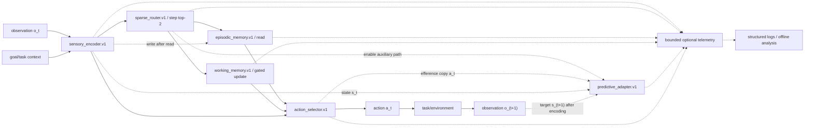

# 最小计算图与冻结时序

本文冻结 P0/P1 的依赖方向和 step 时序。张量验证与类型定义以公共契约为准；图中的模块名称只表示人工计算功能。

## 单 step 顺序

| 顺序 | 操作 | 冻结不变量 |
|---:|---|---|
| 0 | 应用 `reset_mask` | 新 episode 的情景记忆、工作记忆和悬空预测转移在读取前清零。 |
| 1 | 编码 `o_t` | 只消费当前/过去信息；padding 不更新任何状态。 |
| 2 | step 级路由 | 只在 `eligible_modules` 中默认选 top-2；编码器、路由器、选择器始终必经且不计入稀疏率。 |
| 3 | 读取情景记忆 | 严格 `read-before-write`；当前事件不能在同一步命中自身。 |
| 4 | 更新/读取工作记忆 | 门由工作记忆模块根据当前编码与目标产生，不使用未来标签或动作结果。 |
| 5 | 形成动作候选 | 当前编码、记忆输出和目标上下文进入选择器；无效输入被 mask。 |
| 6 | 选择动作并形成预测输入 | 动作 mask 在 logits 归一化与损失前生效；实际 `a_t` 与 `s_t` 构成预测器输入，预测不反馈当前动作。 |
| 7 | 写入情景记忆 | 读取和动作条件形成后写入当前事件；padding/已结束 episode 禁止写。 |
| 8 | 环境返回 `o_(t+1)` | 编码目标后才计算 prediction error；预测和误差只进入辅助损失，不修改当前/下一状态。 |
| 9 | 截断与 telemetry | 每 32 个有效 step detach；telemetry 仅观察归约量，on/off 不改变前述操作。 |

## episode、batch 与梯度边界

- `reset_mask[b,t] = true` 表示 batch item `b` 在 step `t` 读取前开始新 episode；瞬时状态必须清零。
- batch 排列和 padding 不得影响其他 item；状态所有权按 batch item 隔离。
- 默认 TBPTT 窗口为 32 个有效 step。窗口边界保留数值状态但 detach 其 autograd 历史；episode reset 同时清数值状态和历史。
- 情景记忆不跨 episode 持久化；工作记忆和未完成预测也不跨 episode。模型参数、优化器与显式校准统计不属于瞬时状态。
- validation/test/OOD 不更新训练校准统计；各 phase 的路由负载分别聚合。

## 损失与梯度流

总训练目标写作 `L = L_task + Σ λ_i L_aux_i`。每个辅助损失先在自己的有效 mask 上归约为标量，再乘冻结配置权重。P0/P1 不允许 prediction error、telemetry 或评估指标作为运行时状态校正信号；它们只能通过显式 loss 的反向传播影响参数。

## 禁止连接

- telemetry/3D/viewer → 模块输入、路由、loss、optimizer 或动作；
- `o_(t+1)`/target → step `t` 的编码、门、检索、动作；
- 当前事件写入 → 同 step 情景检索；
- 一个 batch item 的 state → 另一个 batch item；
- 硬编码 device 或因 MPS/CUDA 改变计算语义。
