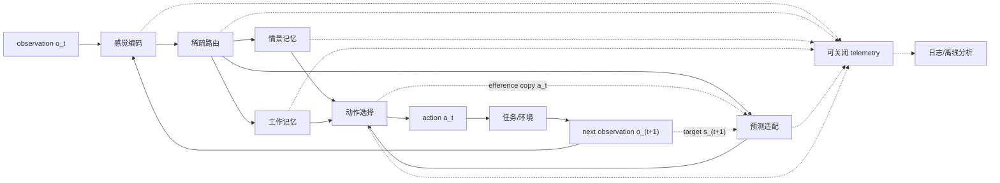

# 最小计算图（DRAFT）

> 本图表达信息依赖与时序，不规定 Python API、张量形状或实现类；`BrainPacket` 与 `ModuleOutput` 仍未冻结。

## 时序不变量

1. 在 step `t`，编码器产生 `s_t`，路由只在当前任务的 `eligible_experts` 中分配可选计算。
2. 情景记忆和工作记忆的读取先于动作选择；写入/状态更新的具体前后顺序必须由任务协议冻结。
3. 预测器在环境返回前使用 `(s_t, a_t)` 产生预测；收到 `s_(t+1)` 后才计算 prediction error。
4. episode/batch 边界必须触发规定的状态清理，禁止样本间泄漏。
5. telemetry 是模型输出的旁路观察，不得反馈到 forward、loss、路由或动作选择。

## 待决定连接

| 决策 | 候选 | 冻结证据 |
|---|---|---|
| 记忆写入时机 | 选择前 / 环境反馈后 | 任务无泄漏测试与消融 |
| 工作记忆更新门来源 | 编码器 / 路由器 / 选择器 | 规则切换与稳定性实验 |
| 预测误差去向 | 仅辅助损失 / 状态校正 | 样本效率与稳定性实验 |
| 路由粒度 | token / step / episode | FLOPs、延迟与性能敏感性 |

这些连接在 P0 独立评审前均为 `DRAFT`。
